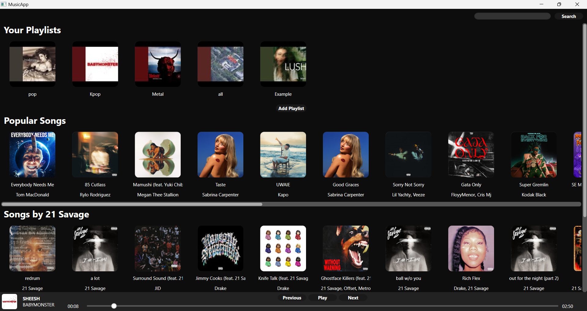
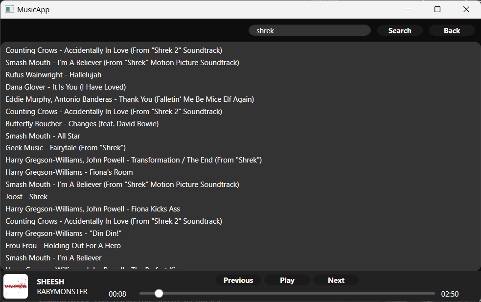
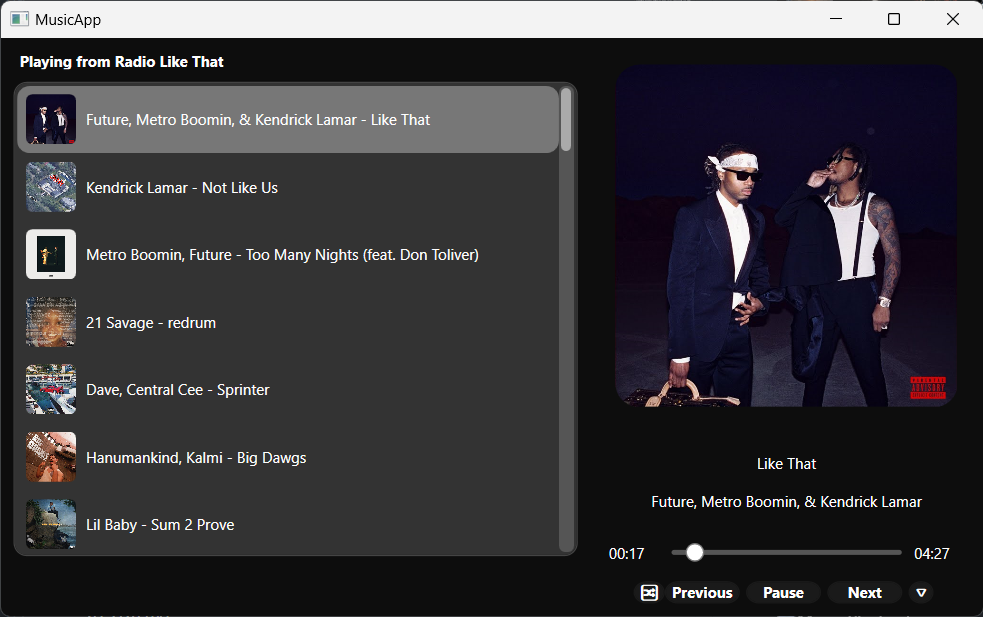

# MusicApp

by **Martin Le**

## Overview

MusicApp is a simple and minimalistic app trying to provide all useful features a great music application must have, leaving behind all unnecessary bloatware.

### Why MusicApp?

Currently there are many music streaming platforms, but unfortunately, all failed in meeting my criteria in finding a perfect platform.

- **Spotify (Free Version):** Offers a great variety of music and a wide range of genres, but due to the frequent occurence of ads and quite low quality of music, the listening experience was limited.
- **YouTube Music:** Offers a better sound quality but the song recommendation system is disappointing, furthermore the web application often loads unnecessary content, leading to an absurd use of RAM and other HW resources and a worse performance.

**MusicApp** solves these issues by providing a:

- **Simple and Smooth Interface:** Minimalistic app with an intuitive interface for a day to day use.
- **Minimal Resource Impact:** Reducing RAM usage, from original 300-500MB with a peak of 800-1000MB to 150-300MB, stable.
- **Balanced Music Recommendations:** Providing a simple yet effective solution to music recommendation, ensuring balanced recommendation of songs, even those you may have forgotten about.

## Features

### User Authentication
- **Google Account Login:** When first launching the app, logging into your google account is necessary in order to provide a satisfiable experience, in terms of synchronization of data.
  
### Music Browsing
- **Browse Music:** Listen to recommended songs or explore music by your favourite authors.
- **Search Functionality:** Find your favorite tracks using the integrated search feature.
  
### Music Playback
- **Stream and Play Music:** Play high-quality music directly from YouTube and YouTube Music.
- **Mini-Player** Offers a swift control and access to currently played music.

### Playlist Management
- **Create and Manage Playlists:** Organize your music into custom playlists.
- **Personalized Recommendations:** Receive music recommendations based on your listening habits, with balanced track frequency to avoid repetition.

### Additional Features
- **Context Menu Integration:** Right-click options for quick actions like adding tracks to playlists.
- **Queue shuffling** Shuffle current songs for a better order of playback.

## Installation

### Prerequisites
- .NET Framework (7.0+)
- Windows OS (10+)

### Installation Steps
1. Download the project from Github repo.
2. Build and run the program.
3. Enjoy

## Usage

### Logging In
1. Launch the application.
2. Log in with your Google account to start browsing and playing music.

### Browsing and Playing Music
- Use the search bar to find music.
- Browse recommended tracks, playlists, and categories.

### Managing Playlists
- Create a new playlist by clicking the "Add Playlist" button.
- Add or detele songs from playlists via the context menu.

## Content

### Main Interface

### Search Music
 

### Music Playback
 

## Technologies Used

MusicApp utilized these technologies and libraries to deliver a smooth and enjoyable music experience:

- **Google YouTube API**: Used for authentication and to interact with YouTube's internal data structures, mainly for operations on playlists and fetching popular songs.

- **YouTubeExplode**: A powerful library used to download music and retrieve metadata from YouTube videos.

- **YouTube Music API**: This API is useful for the song search functionality. It also offers detailed song information fetching.

- **LibVLC (VLC Media Player)**: A versatile and robust media player framework used for playing audio within the application. VLC is known for its support of a wide range of audio formats and provides reliable and high-quality playback functionality.

- **SQLite**: A lightweight and simple solution for local data storing without a need for a difficult server setup. It is a file operation based data management system, for our case more than enough. 

- **Windows Presentation Foundation (WPF)**: Used for a simple, intuitive and smooth GUI experience. Styling of the aesthetic part of the application is possible using the XAML file format.

- **System.Threading.Tasks**: Used extensively for asynchronous operations, mainly for song fetching. We are able fetch dozens of songs at a time, leading to a faster loading time.
